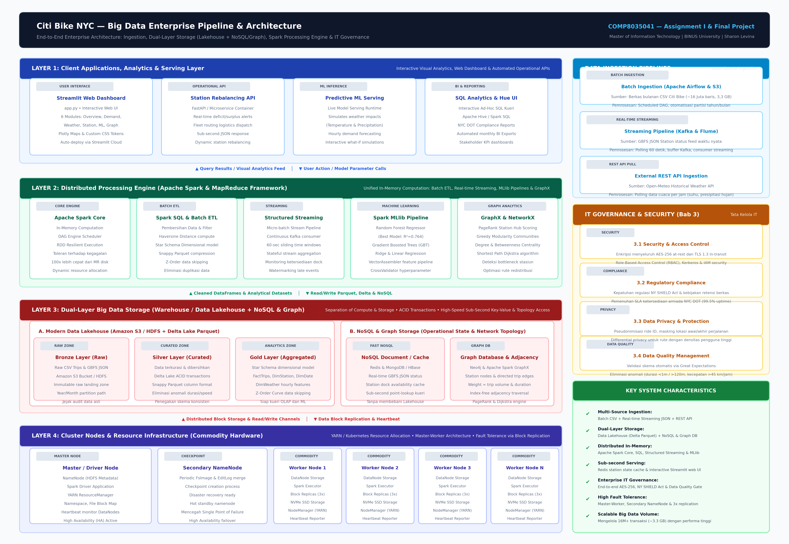

# 🚲 CitiBike NYC — Big Data Analytics & Urban Mobility Platform

An end-to-end Big Data Analytics and Machine Learning system for urban micro-mobility demand forecasting, station network topology analysis, and meteorological impact assessment across New York City.

Built for **COMP8035041 — Big Data Analytics** (Master of Information Technology, BINUS University).

---

## 🌐 Live Application

- **Live Streamlit Dashboard:** [https://citibike-bigdata.streamlit.app/](https://citibike-bigdata.streamlit.app/)
- **Repository:** [https://github.com/sharonlevina/citibike-bigdata](https://github.com/sharonlevina/citibike-bigdata)

---

## 🌟 Key Highlights

- **Massive Volume:** Analysis of ~16.4 Million trip records (~3.3 GB raw data across June–August 2026).
- **Multi-Source Data Variety:**
  - CitiBike Trip Traces (Historical CSV)
  - Station Real-time Metadata via GBFS (JSON feeds)
  - Hourly Meteorological Records via Open-Meteo API (Temperature, Precipitation, Humidity)
- **Big Data Architecture (Lakehouse Pattern):**
  - **Ingestion:** Batch Ingestion (Airflow/S3) + Streaming Feed (Kafka/GBFS) + REST API Ingestion
  - **Storage:** Multi-tier Data Lakehouse (Bronze raw, Silver curated Parquet, Gold aggregated Star Schema) + NoSQL/Graph layer (NetworkX / Neo4j / GraphX)
  - **Processing:** Apache Spark (PySpark DataFrame & Structured Streaming) & MLlib
  - **Serving:** Interactive Streamlit Dashboard with GPU/CSS acceleration
- **Predictive Machine Learning:** Demand forecasting benchmark comparing Random Forest, Gradient Boosting, Ridge, and Linear Regression.
- **Graph & Network Analytics:** PageRank station influence scoring, Louvain/Greedy Modularity community clustering, betweenness centrality bottleneck detection, and Dijkstra shortest redistribution routing.

---

## 🏗️ System Architecture



```text
                                [Data Sources]
        ┌─────────────────────────────┼─────────────────────────────┐
        │                             │                             │
CitiBike Trip CSV              GBFS Station JSON           Open-Meteo Weather API
  (Historical Batch)            (Real-time State)              (Hourly REST)
        │                             │                             │
        ▼                             ▼                             ▼
┌─────────────────────────────────────────────────────────────────────────────┐
│                            DATA INGESTION LAYER                             │
│   • Batch Pipeline: S3 Staging & Automated Partitioning                     │
│   • Streaming Pipeline: Python Kafka Producer / GBFS Poller                 │
│   • External REST API: Automated sync with hourly weather feeds             │
└─────────────────────────────────────┬───────────────────────────────────────┘
                                      │
                                      ▼
┌─────────────────────────────────────────────────────────────────────────────┐
│                            DATA STORAGE LAYER                               │
│   • Bronze Layer: Raw CSV & JSON landed in Cloud Object Storage (S3)        │
│   • Silver Layer: Cleaned, deduplicated columnar Parquet format             │
│   • Gold Layer: Star-Schema dimensional model (FactTrips, DimStation, ...)   │
│   • Graph Storage: Network Adjacency / OD Matrix for topological analysis   │
└─────────────────────────────────────┬───────────────────────────────────────┘
                                      │
                                      ▼
┌─────────────────────────────────────────────────────────────────────────────┐
│                           DATA PROCESSING LAYER                             │
│   • Distributed Engine: Apache Spark (PySpark) Batch & Streaming            │
│   • MLlib Pipeline: VectorAssembler, StandardScaling, CrossValidator        │
│   • Graph Analytics: NetworkX & Spark GraphX (PageRank, Modularity)         │
└─────────────────────────────────────┬───────────────────────────────────────┘
                                      │
                                      ▼
┌─────────────────────────────────────────────────────────────────────────────┐
│                        SERVING & VISUALIZATION LAYER                        │
│   • Streamlit Cloud Application (Interactive UI & Custom CSS Design)        │
│   • Plotly & Folium Geospatial Interactive Maps                             │
│   • Uptime & Health Monitor: Keep-Alive Cron Automation                     │
└─────────────────────────────────────────────────────────────────────────────┘
```

---

## 📊 Dashboard Modules & Pages

The Streamlit dashboard comprises 6 specialized modules accessible from the sidebar:

1. **Overview:** Executive KPIs, 3-month ridership trajectory, fleet composition (Classic vs Electric), and subscriber distribution (Annual Members vs Casual Users).
2. **Demand Analysis:** Diurnal hourly peak patterns, weekday commute vs weekend leisure dynamics, trip duration distributions, and trip distance metrics.
3. **Weather Impact:** Dual-axis correlation between temperature, rainfall, and ridership volume, demonstrating elastic weather sensitivity.
4. **Station Analysis:** Geospatial map of New York City stations, top 10 busiest departure/arrival terminals, and net flow imbalances.
5. **ML Prediction:** Ridership volume forecasting comparing Random Forest, Gradient Boosting, Ridge, and Linear Regression with live user input simulation.
6. **Graph Analytics:** Network science analysis of station connectivity:
   - **PageRank:** Station influence & hub prioritization for bike rebalancing.
   - **Community Detection:** Mobility zone partitioning via greedy modularity optimization.
   - **Centrality Metrics:** Degree & Betweenness centrality identifying structural bottlenecks.
   - **Shortest Path:** Optimal bike redistribution corridor routing using Dijkstra algorithm.

---

## 🔬 Machine Learning Performance

| Model | MAE (trips) | RMSE (trips) | R² Score | Spark MLlib Equivalent |
|---|---|---|---|---|
| **Random Forest Regressor** | **4,120** | **5,380** | **0.764** | `pyspark.ml.regression.RandomForestRegressor` |
| **Gradient Boosting** | 4,450 | 5,710 | 0.732 | `pyspark.ml.regression.GBTRegressor` |
| **Ridge Regression** | 5,820 | 7,190 | 0.589 | `pyspark.ml.regression.LinearRegression(regParam=...)` |
| **Linear Regression** | 5,890 | 7,240 | 0.584 | `pyspark.ml.regression.LinearRegression()` |

---

## 💻 Standalone Graph Analytics Script

In addition to the interactive dashboard, an autonomous CLI graph analysis script is available:

```bash
# Run complete graph network analysis pipeline
python graph_analytics.py
```

Outputs produced in `graph_output/`:
- `pagerank_results.csv`: Complete PageRank influence rankings per station.
- `community_detection.csv`: Station community cluster memberships.
- `centrality_metrics.csv`: Degree, betweenness, in-degree, and out-degree metrics.
- `shortest_path.json`: Sample shortest path route computation between major hubs.

---

## 🚀 Running Locally

### 1. Prerequisites
- Python 3.10 or higher
- Git

### 2. Installation
```bash
# Clone the repository
git clone https://github.com/sharonlevina/citibike-bigdata.git
cd citibike-bigdata

# Create and activate virtual environment (optional)
python -m venv .venv
source .venv/bin/activate  # On Linux/macOS
# or: .venv\Scripts\activate on Windows

# Install dependencies
pip install -r requirements.txt
```

### 3. Launch Dashboard
```bash
python -m streamlit run app.py
```
Open your browser at `http://localhost:8501`.

---

## ☁️ Deployment & Keep-Alive Automation

### Streamlit Community Cloud
This repository is configured for automatic deployment on [Streamlit Community Cloud](https://streamlit.io/cloud). Any push to the `main` branch immediately triggers a rolling update on the live app.

### 💤 Preventing App Sleep Mode (Keep-Alive)
Streamlit Community Cloud automatically puts inactive apps to sleep after ~7 days without visits. To ensure 24/7 availability:

1. **GitHub Actions Cron (Built-in):**  
   The included workflow [`.github/workflows/keep_alive.yml`](.github/workflows/keep_alive.yml) automatically pings the live dashboard every 12 hours.
2. **External Uptime Monitor (Recommended for instant responses):**
   - Register a free account at [UptimeRobot](https://uptimerobot.com).
   - Add a new HTTP(s) Monitor:
     - **URL:** `https://citibike-bigdata.streamlit.app/`
     - **Monitoring Interval:** 5 minutes
   - This ensures the app is always hot in memory and ready for immediate evaluation by lecturers and stakeholders.

---

## 👩‍💻 Author

- **Sharon Levina**
- **Course:** COMP8035041 — Big Data Analytics
- **Program:** Master of Information Technology, BINUS University (2026)
